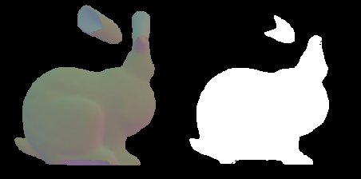
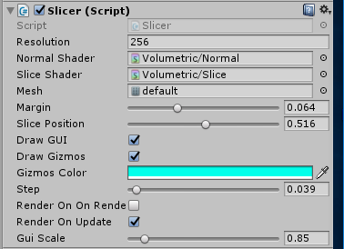
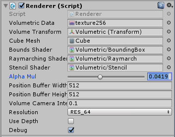
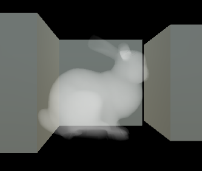
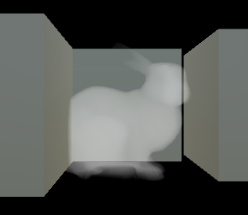

# UnityVolumetric

This project is an exploration of volumetric rendering within unity,
it comes with two modules, the **slicer**, and the **renderer**.

*The roots of this tool are in a VR project developed at [Dpt.](https://dpt.co), where i first experimented with volumetric rendering.*

## Slicer

This component lets you generate a ```Texture3D``` storing volumetric data from a mesh.
To do so, it renders the mesh *slice by slice*, using a custom shader to isolate pixels
which are *inside* the mesh.



Specifically, for each slice:
- on the left, we render the mesh normals in a renderTexture
- on the right, we then sample this texture, a pixel is *inside* if the dot product of its normal and the backward vector is above zero. We use the **gradient of the normal field to remove pixels at the edges of the model that might cause aliasing**

Component Inpector:
- ```Resolution``` size of the volumetric data, which will contain Resolution^3 voxels (we only handle cubic volumes at the moment)
- ```Margin``` how much empty space should be left around the mesh
- ```Slice Position``` normalized position of the "cut" within the volume, useful for preview, is animated form 0 to 1 when rendering the volume
- ```Step``` a threshold applied to the dot product of a normal and the back direction vector to decide wether a pixel is in the volume, you typically want it to be slightly above 0 as a false positive is worse than a false negative



## Renderer

The renderer gets passed a ```Texture3D``` representing a volume, 
and renders it using raymarching.
It is possible to set:

- the number of steps for raymarching,




- wether or not depth is taken in account 
  (in this case at each step on the ray depth is tested against the scene depth read from the camera depthbuffer).

*Rendering without depth, the object is overlayed on the scene*



*Rendering with depth turned on, the volume blends with scene elements*

